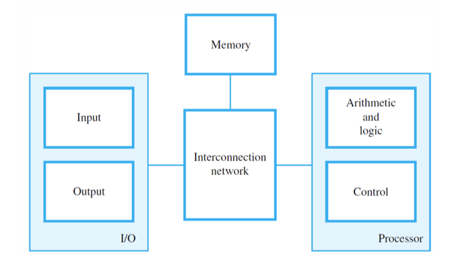
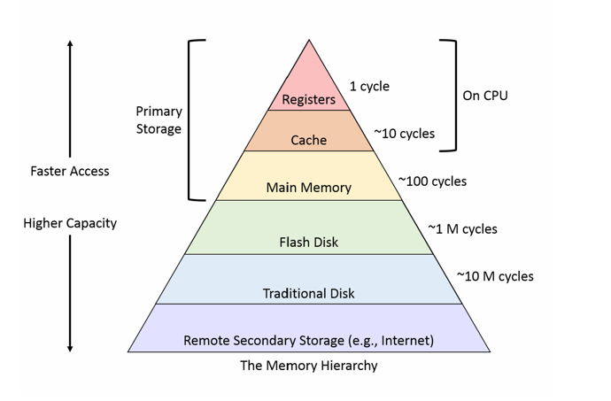

# MEMORY HIERARCHY

## MEMORY UNIT

Memory unit is one of the functional units in a computer. In computing, it refers to a component of a computer system that stores data for later retrieval.

This can include:

- Random Access Memory (RAM) for temporary storage while the computer is running.
- Various forms of persistent storage like:
  - Hard drives
  - Solid State Drives (SSD)
  - Flash memory

These are used for long-term storage of data even when the computer is turned off.
# MEMORY HIERARCHY

The arrangement of various memory types in a computer system according to their size, speed, and proximity to the central processing unit is known as memory hierarchy. By allowing for greater store capacity for information that is not frequently accessed, this hierarchy is intended to maximize overall system efficiency by facilitating quick access to commonly utilized data and instructions.

The notion of memory hierarchy acknowledges that not every piece of information and instruction within a computer program is accessed as frequently or urgently as others. Computer systems are able to efficiently balance speed, cost, and capacity for a variety of computational tasks by utilizing a hierarchical memory arrangement.

To put it another way, memory hierarchy can be compared to a pyramid, with RAM and secondary storage devices like hard drives at the base and CPU registers and cache memory, which are the smallest and quickest memory units, at the top. By doing this, the computer may retrieve data from slower storage devices more rapidly and spend less time waiting for information that it needs.

A concept in computer architecture known as memory hierarchy arranges various forms of computer memory into a hierarchy according to factors including  size,cost and speed.Memory hierarchy serves the primary function of bridging the gap between the slower but larger and less expensive memory (like RAM and disk storage) and the faster but more expensive and limited memory immediately accessible by the CPU (like registers and cache). 

The levels of memory hierarchy in a typical computer system, ordered from fastest and smallest to slowest and largest, are as follows:

1. Registers

2. Cache

3. Main Memory

4. Flash Disk

5. Traditional Disk

6. Remote Secondary Storage

Memory hierarchy serves the primary function of bridging the gap between the slower but larger and less expensive memory (like RAM and disk storage) and the faster but more expensive and limited memory immediately accessible by the CPU (like registers and cache). It arranges various memory types in a computer system according to factors including size, cost, and speed.

The levels of memory hierarchy in a typical computer system, ordered from fastest and smallest to slowest and largest, are as follows:

# Registers
Registers are the smallest and fastest storage units in a computer system when it comes to memory hierarchy. Registers are integral to the operation of the CPU and are therefore usually not explicitly included in the memory hierarchy, but they are essential to system performance. Registers are places where data and instructions that the CPU is currently processing are temporarily stored. They include data that is required to carry out instructions, such as memory addresses for data access, operands for arithmetic and logical operations, and intermediate outcomes of calculations. Registers are essential for effective instruction execution and data manipulation during program execution. Registers are sometimes regarded as the first level of memory in terms of access speed, even though they are not directly included in the memory hierarchy. With access times measured in nanoseconds, registers have the fastest access times of any memory component. Registers are used to store important information and instructions that the CPU needs to access right away while executing a program because of their close proximity to the CPU and fast processing speed. Registers have numerous real-time applications across various computing systems, including processor operations, system control, function calls and subroutines, data movement, interrupt handling, and embedded systems.

# Cache Memory
 In a computer system, cache memory is a kind of high-speed volatile memory that sits between the CPU (central processing unit) and RAM (main memory). It reduces the average time taken to access memory by acting as a buffer to speed up data access by storing frequently used commands and data. The basic goal of cache memory is to close the speed difference between the slower but more capacious main memory (RAM) and the faster but smaller CPU.

Cache memory minimizes the need to access slower main memory by keeping frequently accessed information and instructions closer to the CPU, therefore enhancing system speed.

## Establishment

There are different layers of cache memory, called L1, L2, and occasionally L3 cache. L2 cache is larger and located farther away from the CPU than L1 cache, which is the smallest. An extra L3 cache, which is larger still and frequently shared by several CPU cores, may be present in some systems.

## Data Management

Cache memory employs caching algorithms to determine which data and instructions to store in the cache and how to manage the cache's contents efficiently. Common caching algorithms include least recently used (LRU), least frequently used (LFU), and random replacement.

## Cache Coherency

In multi-core systems where multiple CPU cores share access to the same cache memory, cache coherency protocols ensure that all cores have a consistent view of memory. These protocols manage data synchronization and maintain data integrity across multiple caches.
## Cache Memory

Cache memory plays a crucial role in modern computer systems, helping to optimize the use of available resources and improve overall system responsiveness and efficiency.

## Cache Hit and Cache Miss

The cache determines if the desired data or instructions are already in the cache when the CPU makes a request for them from memory. If so, it is referred to as a cache hit and allows for speedy data retrieval. It is referred to as a cache miss when the requested data cannot be found in the cache; this requires more time to fetch the data from main memory.

## Cache Size and Performance

System performance is greatly impacted by the amount and configuration of cache memory. Performance can be enhanced by larger caches since they can store more data and cause fewer cache misses. Larger caches, however, also usually cost more and use more electricity.

## Consistent View of Memory and Cache Coherency

In multi-core systems where multiple CPU cores share access to the same cache memory, cache coherency protocols ensure that all cores have a consistent view of memory. These protocols manage data synchronization and maintain data integrity across multiple caches.

Cache memory finds real-world applications in various computing systems to enhance...

Cache memory plays a crucial role in modern computer systems, helping to optimize the use of available resources and improve overall system responsiveness and efficiency. Here are some examples of its real-world applications:

1. Web Servers and Content Delivery Networks (CDNs)
2. Database Systems
3. Operating Systems
4. Graphics Processing Units (GPUs)
5. Artificial Intelligence and Machine Learning
6. Embedded Systems
7. Networking Equipment

# Main Memory

Main memory is a form of volatile computer memory that is sometimes called "primary memory" or random-access memory (RAM). It is used to store data and instructions that are actively being used by the CPU (central processing unit) during program execution. It acts as a computer system's main working memory, enabling quick access to the information and commands needed to complete tasks.

## Important Details

- Main memory is volatile, which means that it needs constant power to hold onto the data it has stored. The information kept in main memory is lost when the power is switched off or the machine is restarted.
## Non-Volatile Storage Technologies

Non-volatile storage technologies, such as solid-state drives (SSDs) and hard disk drives (HDDs), maintain data even in the event of a power outage.

## Speed

When it comes to access times, main memory is quicker than secondary storage like HDDs and SSDs. Compared to secondary storage, which frequently has access times measured in milliseconds, main memory typically has access times measured in nanoseconds, making it substantially faster.

## Capacity

The capacity of main memory determines how much information and instructions may be stored at once. In current computing systems, main memory capacities can vary greatly, from a few gigabytes to several terabytes. However, because of financial constraints and physical limitations, main memory capacities are typically lower than those of secondary storage devices.

# Flash Disk

A flash disk, also known as a USB flash drive, thumb drive, or memory stick, is a portable storage device that uses flash memory to store data. It is a type of non-volatile storage medium that is widely used for transferring and storing digital files such as documents, photos, videos, and software applications.

*Key Features and Characteristics:*
1. *Flash Memory:* Flash disks use NAND flash memory technology, which is non-volatile.
2. *Portable and Compact:* Small, lightweight, and designed for easy portability.

*Real-world Applications:*
1. Data Storage and Transfer
2. Backup and Disaster Recovery
3. Software Distribution
4. Portable Applications

---

# Traditional Disks (HDDs)

*Key Characteristics and Features:*
1. *Magnetic Storage*
2. *Moving Parts*
3. *Capacity*
4. *Speed*
5. *Cost-Effectiveness*

*Real-world Applications:*
1. Secondary Storage
2. File Systems
3. Data Backup and Recovery
4. Archival Storage

---

# Secondary Storage

*Definition:* Non-volatile storage used for long-term data retention.

*Characteristics:*
- Non-Volatile
- Large Capacity
- Slower Access Times
- Various Types
- Data Persistence
- Backup and Recovery
- Archival Storage